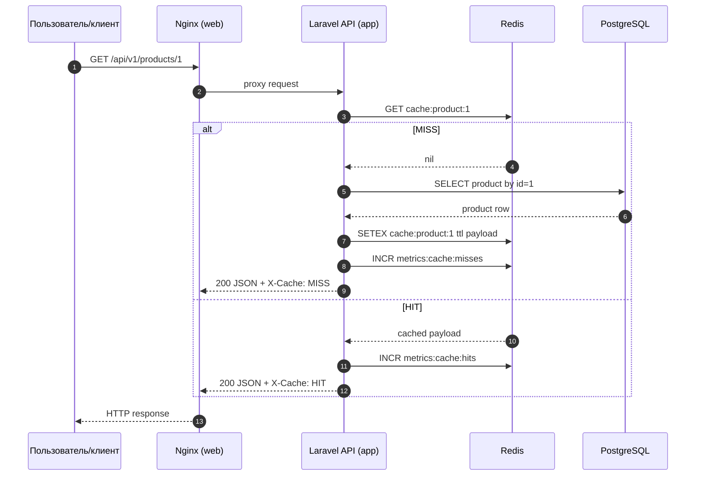
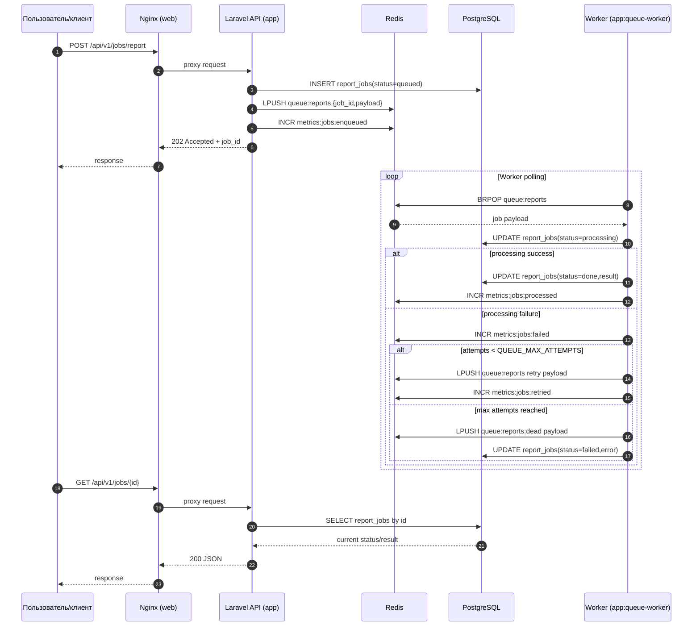
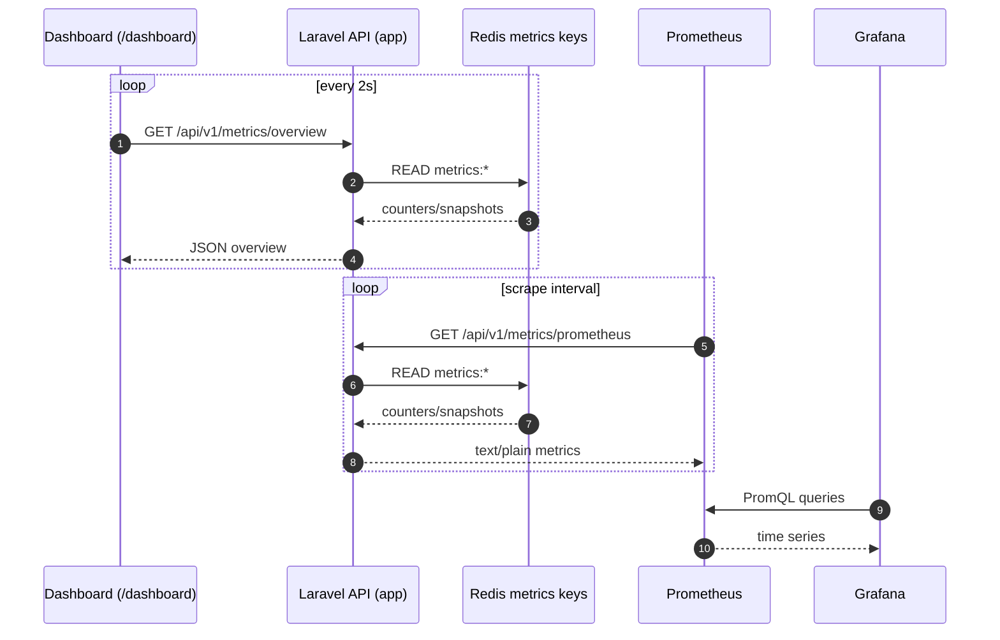
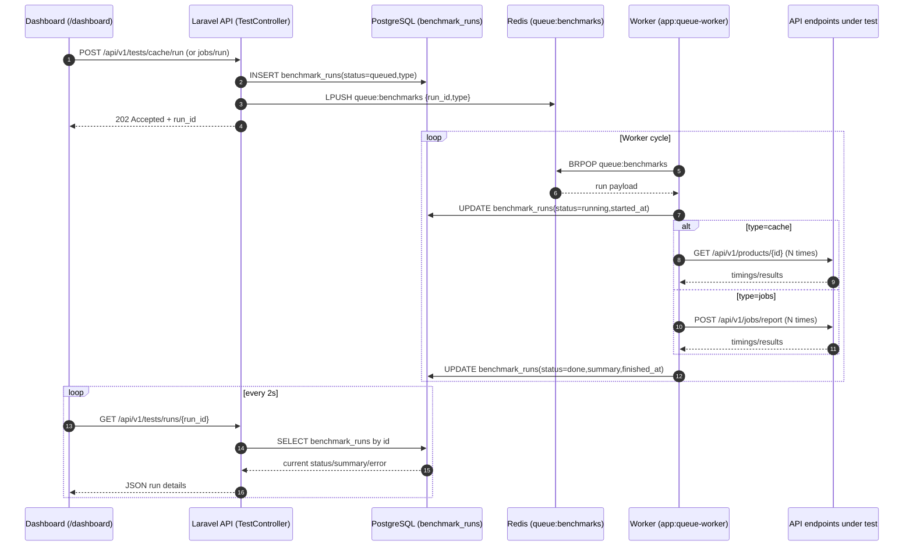

# Redis Demo Platform: Cache + Queue + Observability

Проект демонстрирует, как `Redis` ускоряет API через кеширование и разгружает backend через очередь задач, а также как это подтверждается метриками в реальном времени.

## Идея проекта

Цель проекта — сделать наглядный портфолио-стенд, где можно:
- увидеть разницу между `cache MISS` и `cache HIT` на одном endpoint;
- запустить асинхронные задачи и наблюдать жизненный цикл очереди;
- смотреть метрики сразу в трех местах: внутренний UI, `Prometheus`, `Grafana`;
- воспроизводимо прогонять нагрузочные/синтетические тесты.

## Стек технологий

### Backend
- `Laravel` (PHP 8.3) — REST API, worker-команда, бизнес-логика.
- `PostgreSQL` — основное хранилище (`products`, `report_jobs`, `benchmark_runs`).
- `Redis` — кеш (`cache-aside`), очередь (`Redis List`), счетчики метрик.

### Frontend
- `React + TypeScript` — страница `/dashboard` для управления демо.
- `Vite` — сборка фронтенда.
- `Tailwind CSS` — UI-стили.

### Инфраструктура и наблюдаемость
- `Docker Compose` — единое локальное окружение.
- `Nginx` — reverse proxy к Laravel (`php-fpm`).
- `Prometheus` — сбор метрик с `/api/v1/metrics/prometheus`.
- `Grafana` — визуализация метрик (dashboard provisioning).
- `RedisInsight` — просмотр ключей, очередей и dead-letter.
- `k6` (через Docker) — нагрузочные сценарии.

## Архитектура и как это работает

### 1) Cache-aside сценарий

Endpoint: `GET /api/v1/products/{id}`

Логика:
1. API проверяет ключ `cache:product:{id}` в Redis.
2. Если значение есть — возвращает `HIT`.
3. Если значения нет — читает из PostgreSQL, кладет в Redis с TTL и возвращает `MISS`.

Для наглядности в ответах есть заголовки:
- `X-Cache: HIT|MISS`
- `X-Response-Time-Ms: <ms>`

### 2) Очередь задач

Endpoints:
- `POST /api/v1/jobs/report`
- `POST /api/v1/jobs/report/bulk`
- `GET /api/v1/jobs/{id}`

Логика:
1. API принимает задачу и быстро возвращает `job_id`.
2. Задача кладется в `Redis List`.
3. Worker (`php artisan app:queue-worker`) забирает задачу из очереди.
4. Статус и результат сохраняются в PostgreSQL.
5. Поддержаны retry и dead-letter (`queue:reports:dead`).

### 3) Метрики и дашборды

Метрики доступны через:
- `GET /api/v1/metrics/cache`
- `GET /api/v1/metrics/queue`
- `GET /api/v1/metrics/overview`
- `GET /api/v1/metrics/prometheus` (для Prometheus)

Что наблюдаем:
- `cache_hits_total`, `cache_misses_total`, `cache_hit_rate`;
- `queue_depth`, `dead_letter_depth`;
- `jobs_enqueued_total`, `jobs_processed_total`, `jobs_failed_total`, `jobs_retried_total`;
- latency API (средние и перцентили по endpoint).

### 4) UI на основном сайте

Страница: `GET /dashboard`

Функции UI:
- автообновление метрик каждые 2 секунды;
- запуск синтетических тестов (cache/jobs) асинхронно;
- кнопки demo-операций (`flush cache`, `reset metrics`, `bulk enqueue`);
- история последних запусков тестов из таблицы `benchmark_runs`.

## Быстрый старт

### Требования
- `Docker` + `Docker Compose`
- `PowerShell` (для скрипта `k6`, опционально)

Локально `Node.js` не обязателен: фронтенд собирается внутри контейнера `app`.

### Шаг 1. Подготовка окружения

```bash
cp .env.example .env
```

### Шаг 2. Запуск сервисов

```bash
docker compose up -d --build
```

### Шаг 3. Миграции

```bash
docker compose exec app php artisan migrate --force
```

### Шаг 4. Проверка

```bash
docker compose ps
curl http://localhost:8080/api/v1/health
curl http://localhost:8080/api/v1/health/deps
```

## Как работать с проектом

### Основные URL
- Приложение: [http://localhost:8080](http://localhost:8080)
- Dashboard UI: [http://localhost:8080/dashboard](http://localhost:8080/dashboard)
- Prometheus: [http://localhost:9090](http://localhost:9090)
- Grafana: [http://localhost:3000](http://localhost:3000)
- RedisInsight: [http://localhost:5540](http://localhost:5540)

### Полезные команды

```bash
# shell в app-контейнере
docker compose exec app sh

# запуск тестов Laravel
docker compose exec app php artisan test

# просмотр логов app/worker
docker compose logs -f app
docker compose logs -f worker

# остановка окружения
docker compose down
```

### Демонстрационный сценарий (рекомендуемый)

```bash
# 1) сбросить метрики и кеш
curl -X POST http://localhost:8080/api/v1/demo/metrics/reset
curl -X POST http://localhost:8080/api/v1/demo/cache/flush

# 2) показать MISS -> HIT
curl http://localhost:8080/api/v1/products/1
curl http://localhost:8080/api/v1/products/1

# 3) сгенерировать пачку задач
curl -X POST http://localhost:8080/api/v1/demo/jobs/enqueue
```

## Настройка инструментов

### RedisInsight

1. Откройте [http://localhost:5540](http://localhost:5540).
2. Нажмите `Add Redis Database`.
3. Укажите:
   - Host: `redis`
   - Port: `6379`
   - Username/Password: пусто (по умолчанию).
4. Проверьте ключи:
   - `cache:product:*`
   - `queue:reports`
   - `queue:reports:dead`
   - `metrics:*`

### Prometheus

1. Откройте [http://localhost:9090](http://localhost:9090).
2. Перейдите `Status -> Targets`.
3. Убедитесь, что target `laravel_metrics` имеет состояние `UP`.
4. Попробуйте запросы:
   - `cache_hits_total`
   - `cache_misses_total`
   - `queue_depth`
   - `jobs_processed_total`

### Grafana

1. Откройте [http://localhost:3000](http://localhost:3000).
2. Войдите:
   - Login: `admin`
   - Password: `admin` (или значения из `.env`).
3. Откройте dashboard `Redis Demo Overview`.
4. Убедитесь, что панели показывают данные:
   - Cache Hit Rate
   - Queue Depth
   - Jobs Counters
   - Dead Letter Depth
   - API Latency

### k6 (нагрузочное тестирование)

Сценарии:
- `load-tests/k6-cache.js`
- `load-tests/k6-jobs.js`

Запуск:

```bash
powershell -ExecutionPolicy Bypass -File .\load-tests\run-step5.ps1
```

Результаты:
- `load-tests/results/cache-summary.json`
- `load-tests/results/jobs-summary.json`

## Переменные окружения (ключевые)

### Общие
- `APP_PORT` — порт web (`8080` по умолчанию).
- `POSTGRES_*` — параметры PostgreSQL.
- `REDIS_PORT` — порт Redis (`6379`).

### Кеш
- `CACHE_TTL_SECONDS`
- `CACHE_MISS_DELAY_MS`

### Очередь
- `QUEUE_NAME`
- `QUEUE_POP_TIMEOUT`
- `QUEUE_MAX_ATTEMPTS`
- `JOB_STATUS_TTL_SECONDS`
- `JOB_PROCESSING_DELAY_MS`

### Метрики/дашборды
- `PROMETHEUS_PORT`
- `PROMETHEUS_RETENTION`
- `GRAFANA_PORT`
- `GRAFANA_ADMIN_USER`
- `GRAFANA_ADMIN_PASSWORD`

## Frontend build внутри Docker

Сборка фронтенда вынесена в отдельный build-stage (`frontend-builder`) в `docker/php/Dockerfile`.
На этапе `docker build` выполняется `npm install` и `npm run build`, а готовые ассеты копируются в runtime-образ.
При старте `app` контейнера эти ассеты синхронизируются в shared volume `frontend_build`, который читается `web`.

Итог:
- локальный `Node.js` не нужен;
- `app` стартует без ожидания frontend-сборки;
- после рестарта контейнеров нет временного `502`, связанного с `vite build` в entrypoint.

## API (кратко)

- Health:
  - `GET /api/v1/health`
  - `GET /api/v1/health/deps`
- Products cache demo:
  - `GET /api/v1/products/{id}`
- Queue demo:
  - `POST /api/v1/jobs/report`
  - `POST /api/v1/jobs/report/bulk`
  - `GET /api/v1/jobs/{id}`
- Metrics:
  - `GET /api/v1/metrics/cache`
  - `GET /api/v1/metrics/queue`
  - `GET /api/v1/metrics/overview`
  - `GET /api/v1/metrics/prometheus`
- Demo controls:
  - `POST /api/v1/demo/cache/flush`
  - `POST /api/v1/demo/metrics/reset`
  - `POST /api/v1/demo/jobs/enqueue`
- UI tests:
  - `POST /api/v1/tests/cache/run`
  - `POST /api/v1/tests/jobs/run`
  - `GET /api/v1/tests/runs`
  - `GET /api/v1/tests/runs/{id}`

## Диаграммы взаимодействия

### 1) Cache test (`MISS -> HIT`)



### 2) Jobs test (enqueue + async worker)



### 3) Поток метрик (UI + Prometheus + Grafana)



### 4) UI benchmark test (`/api/v1/tests/*`)




